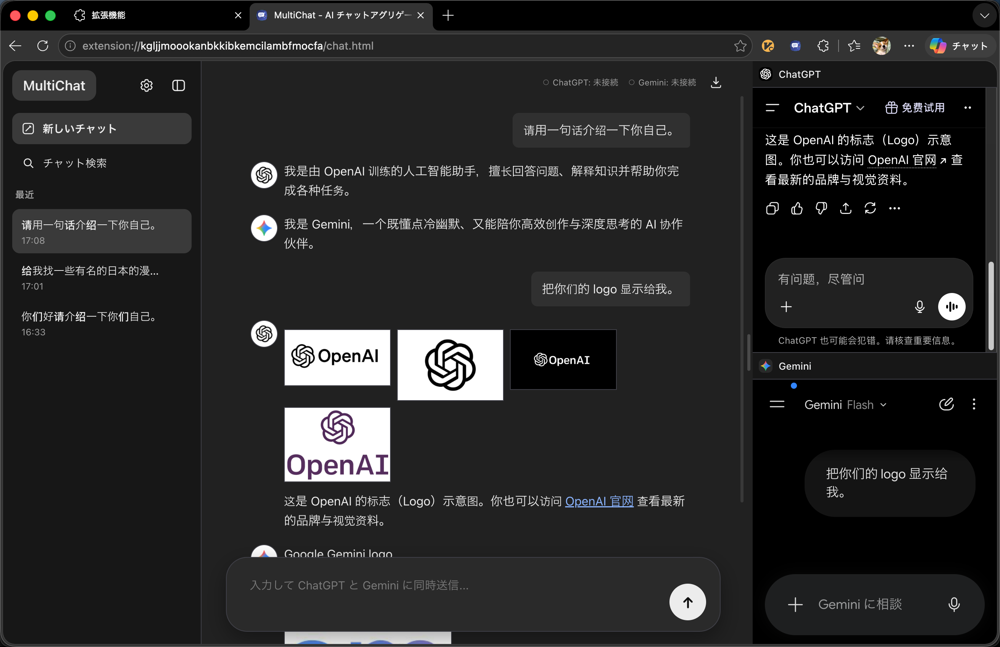

# MultiChat

## 中文

`MultiChat` 是一个多 AI 聚合聊天扩展。

它不依赖用户自己配置 `API Key`，而是在同一个界面里并排保留多个已登录的 AI 网页会话，再把右侧网页里的回答实时聚合到左侧统一聊天区中。这样你可以在一个地方同时提问、比较、整理并沉淀多个 AI 的回答。

### 核心特点

- 一个界面同时与多个 AI 对话
- 不需要自己配置 `API Key`
- 不直接消耗自己的 API 配额
- 右侧保留原始网页会话，左侧统一聚合结果
- 支持文字、代码、链接、图片等内容聚合显示
- 支持将聊天内容导出为带图片资源的离线 Markdown 文档

### 工作方式

`MultiChat` 会在扩展页面右侧嵌入多个 AI 官方网页。  
当你在左侧发送一个问题后，扩展会把同一条消息发送到当前启用的多个网页会话中，再把这些网页返回的内容抓取并汇总到左侧统一视图里。

### 适用场景

- 同时询问 `ChatGPT`、`Gemini` 等多个 AI
- 横向比较多个模型的回答差异
- 收集资料、整理灵感、沉淀研究过程
- 保存带图片的聊天记录作为离线文档

### 导出能力

导出结果包括：

- `chat.md`
- 聊天中引用到的图片
- 对应的本地图片路径引用

这样导出的内容不只是纯文本，而是一份可以离线查看、继续整理和归档的 Markdown 资料包。

### 下载

发布时我们会直接提供已构建好的扩展产物，用户下载后即可使用，无需自行本地构建。

### 提醒

这是一个基于网页会话聚合的工具，因此目标网站一旦改版，部分选择器、抓取逻辑或显示结构可能需要同步调整。

## English

`MultiChat` is a multi-AI chat aggregation extension.

Instead of requiring users to configure their own `API Key`, it keeps multiple logged-in AI web sessions active in one interface and aggregates their responses into a unified chat view. This allows users to ask once, compare answers side by side, and organize research materials more efficiently.

### Key Features

- Talk to multiple AI services in one interface
- No need to configure your own `API Key`
- No direct consumption of personal API quota
- Keep original web sessions on the right and aggregated results on the left
- Support text, code, links, and images
- Export conversations as offline Markdown packages with images

### How It Works

`MultiChat` embeds multiple official AI web apps on the right side of the extension page.  
When a user sends one prompt from the left panel, the extension forwards it to all enabled providers and then aggregates their responses into a unified conversation view.

### Use Cases

- Query multiple AI tools such as `ChatGPT` and `Gemini` at the same time
- Compare model responses side by side
- Collect research materials and organize findings
- Save image-rich conversations as offline documents

### Export

The exported package includes:

- `chat.md`
- Referenced images from the conversation
- Local paths linked inside the document

This makes the final export suitable for offline reading, archiving, and further knowledge organization.

### Download

We will provide prebuilt extension packages for release, so users can directly download and use them without building locally.

### Note

Since this project relies on live web session integration, selector logic and capture behavior may need updates whenever the target websites change their DOM structure.

## 日本語

`MultiChat` は、複数の AI を 1 つの画面に集約して使えるチャット拡張機能です。

ユーザー自身が `API Key` を設定する必要はなく、ログイン済みの複数の AI Web セッションを同じ画面内に保持し、それぞれの応答を左側の統合チャットビューに集約します。これにより、1 回の質問で複数の AI の回答を比較し、情報を整理しやすくなります。

### 主な特徴

- 1 つの画面で複数の AI と会話できる
- `API Key` の設定が不要
- 個人の API 利用枠を直接消費しない
- 右側に元の Web セッションを保持し、左側に結果を集約
- テキスト、コード、リンク、画像に対応
- 画像付きの Markdown オフライン文書としてエクスポート可能

### 仕組み

`MultiChat` は拡張ページの右側に複数の AI 公式 Web ページを埋め込みます。  
左側から 1 回質問すると、その内容が有効な各プロバイダへ送信され、返ってきた回答が左側の統合ビューにまとめて表示されます。

### 利用シーン

- `ChatGPT` や `Gemini` など複数の AI に同時に質問する
- モデルごとの回答差を比較する
- 調査資料やアイデアを整理する
- 画像付きチャットをオフライン文書として保存する

### エクスポート

エクスポート内容には以下が含まれます：

- `chat.md`
- 会話内で参照された画像
- 文書内で参照されるローカル画像パス

これにより、オフラインで閲覧・整理・保管しやすい Markdown 資料として活用できます。

### ダウンロード

公開時にはビルド済みの拡張パッケージをそのまま配布するため、ユーザーがローカルでビルドする必要はありません。

### 注意

このプロジェクトは実際の Web セッション連携に依存しているため、対象サイトの DOM 構造が変更された場合は、選択器や取得ロジックの調整が必要になることがあります。
